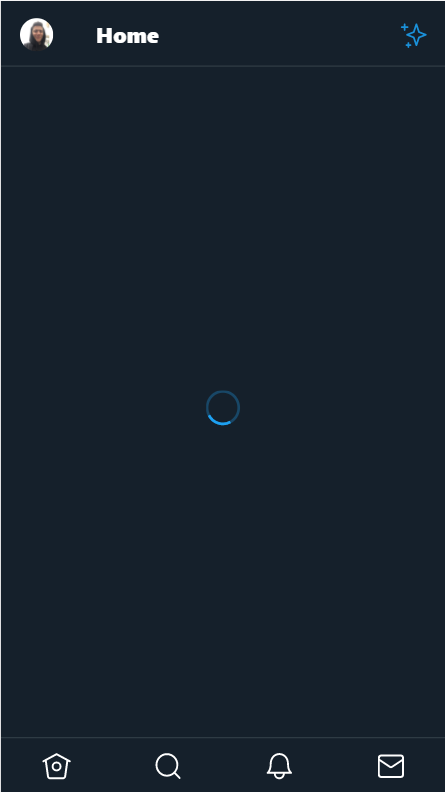
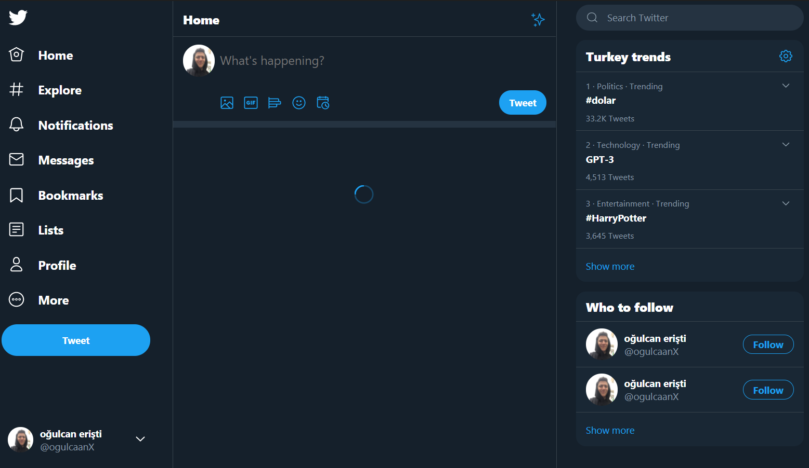

This is a Twitter clone app with [Next.js](https://nextjs.org/) and bootstrapped with [`create-next-app`](https://github.com/vercel/next.js/tree/canary/packages/create-next-app).

## [Live Demo]()

#### Install deps

```bash
$ npm install
#or
$ yarn install
```

#### In the project directory, run the development server::

```bash
$ npm run dev
#or
$ yarn dev
```

Open [http://localhost:3000](http://localhost:3000) with your browser to see the result.

### Screenshots



